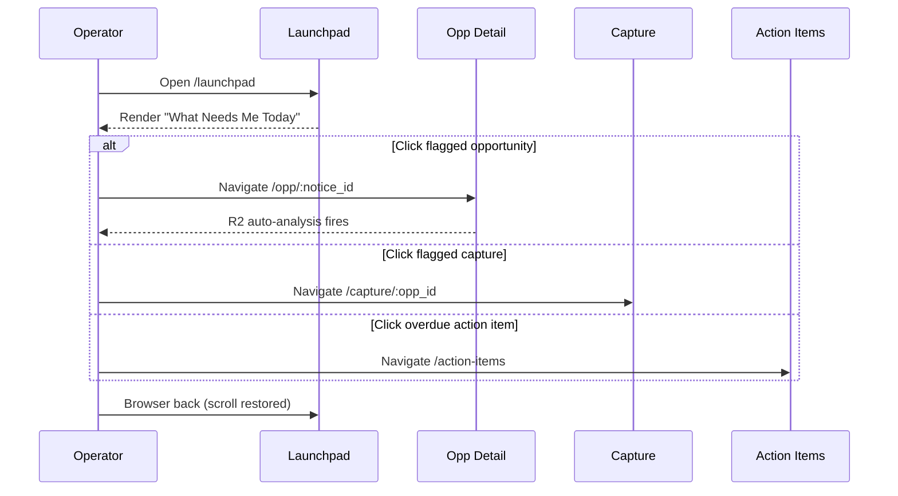
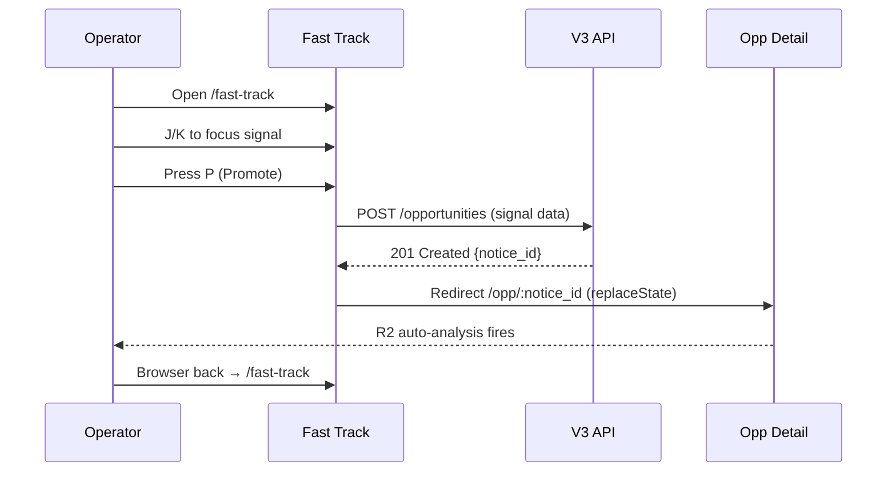
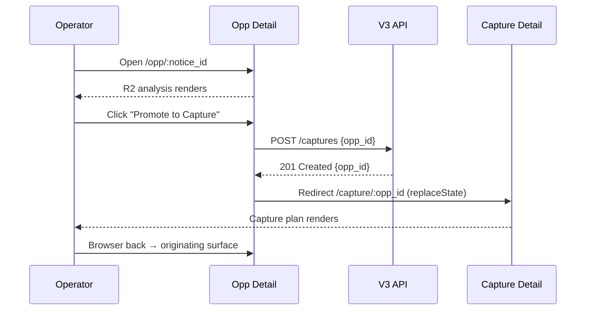
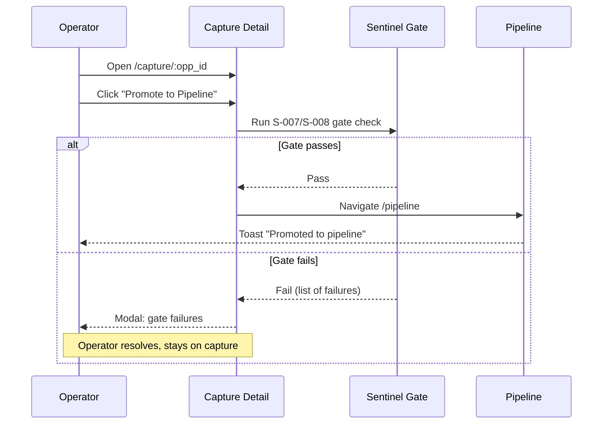
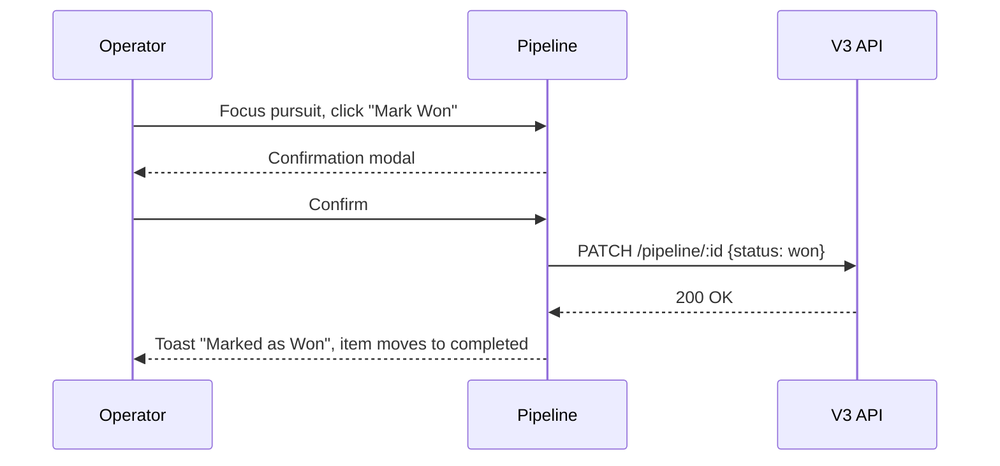
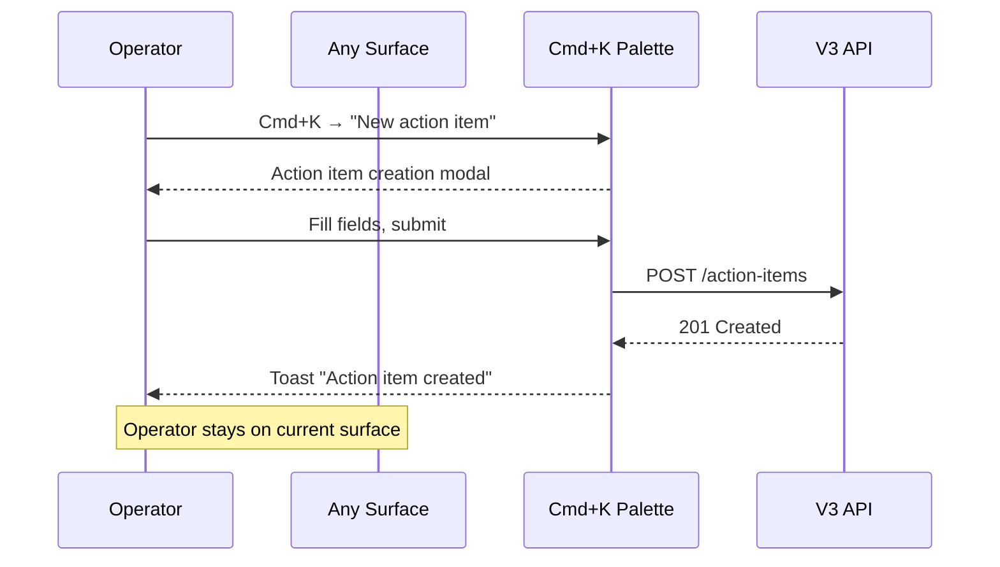

# D1 — Information Architecture + Six-Surface Flow Spec

**Parent:** F-215 (#426)
**Status:** Draft
**Date:** 2026-05-30
**Author:** Devin (automated)
**Audience:** Operator (Shawn), front-end engineering

---

## 0. Governing References

Every design decision in this document traces to one of five reference platforms. Citations use the shorthand below.

| Shorthand | Platform | What we lift |
|---|---|---|
| **Linear** | Linear.app | Visual language, keyboard model, dense list UI, Cmd+K palette |
| **Foundry** | Palantir Foundry | Object-centric IA, left rail + canvas + inspector layout |
| **Lattice** | Anduril Lattice | Operator briefing posture, "what needs me now" prioritization |
| **Shipley** | Shipley BD Lifecycle | Capture workflow stages, color review gates |
| **GovSignals** | GovSignals.com | Domain posture for GovCon signal triage |

Canonical design tokens are defined in `docs/canonical/aesthetics_canonical_v1.md` and are **not** repeated here. This document specifies structure and flow; D2 owns visual design.

---

## 1. Surface Inventory (Canonical)

GDA Command V3 exposes **six primary surfaces** plus a **Settings sidecar**. Every surface is flat — no nested tabs at the top of pages. *(Ref: Foundry — surfaces are object containers, not tab groups.)*

### 1.1 Launchpad

| Attribute | Value |
|---|---|
| **Purpose** | Operator daily briefing: what happened, what needs you, what's at risk. |
| **Primary intent** | "When I open this, I'm trying to see what needs my attention right now." |
| **Entry routes** | `/launchpad` (default landing after login) |
| **Exit routes** | Click any flagged item → `/opp/:notice_id`, `/capture/:opp_id`, `/action-items`; Click "Fast Track" chip → `/fast-track`; Click pipeline item → `/pipeline` |
| **Data dependencies** | `GET /api/v3/launchpad/summary`, `GET /api/v3/launchpad/flags`, `GET /api/v3/action-items?due=today` |

*(Ref: Lattice — "what needs me now" replaces opinion with prioritized facts.)*

### 1.2 Fast Track

| Attribute | Value |
|---|---|
| **Purpose** | Emerging technology signal triage and rapid promotion to opportunity. |
| **Primary intent** | "When I open this, I'm trying to evaluate new signals and decide which to promote." |
| **Entry routes** | `/fast-track` (nav rail); `/fast-track/signal/:signal_id` (deep link to specific signal) |
| **Exit routes** | Promote signal → opportunity created → redirect to `/opp/:notice_id`; Dismiss signal → stays on `/fast-track`; Click existing opp link → `/opp/:notice_id` |
| **Data dependencies** | `GET /api/v3/opportunities?status=signal` (signals are pre-qualification opportunities), `POST /api/v3/opportunities` (on promote) |

*(Ref: GovSignals — domain-aware signal triage; Linear — dense list with J/K navigation.)*

### 1.3 Opportunities

| Attribute | Value |
|---|---|
| **Purpose** | Full opportunity feed — discovery, qualification, grading. |
| **Primary intent** | "When I open this, I'm trying to find, filter, and qualify opportunities." |
| **Entry routes** | `/opportunities` (nav rail); `/opp/:notice_id` (deep link to single opportunity — fires R2 auto-analysis on open) |
| **Exit routes** | Promote to pipeline → `POST /api/v3/opportunities/:id/qualify` → redirect to `/pipeline`; Open detail → `/opp/:notice_id`; Create action item → `/action-items` |
| **Data dependencies** | `GET /api/v3/opportunities` (list), `GET /api/v3/opportunities/:id` (detail, triggers R2), `GET /api/v3/sources/:id` (R1 source resolution) |

*(Ref: Foundry — object-centric detail view; GovSignals — grading posture with A/B/C evidence.)*

### 1.4 Capture

| Attribute | Value |
|---|---|
| **Purpose** | Proposal capture management — plans, compliance, color reviews, RFP shredder. |
| **Primary intent** | "When I open this, I'm trying to build, track, and review capture plans for qualified pursuits." |
| **Entry routes** | `/capture` (nav rail — list view); `/capture/:opp_id` (deep link to specific capture plan) |
| **Exit routes** | Promote to pipeline (Sentinel gate check) → `/pipeline`; Open linked opportunity → `/opp/:notice_id`; Create action item → `/action-items` |
| **Data dependencies** | `GET /api/v3/captures` (list), `GET /api/v3/captures/:id` (detail), `GET /api/v3/partners/:id` (teaming context), `GET /api/v3/sources/:id` |

*(Ref: Shipley — capture workflow with color review gates; Foundry — canvas + inspector layout for plan detail.)*

### 1.5 Pipeline

| Attribute | Value |
|---|---|
| **Purpose** | Qualified pursuit tracking with win probability and Sentinel gate enforcement. |
| **Primary intent** | "When I open this, I'm trying to see where every qualified pursuit stands and what to prioritize." |
| **Entry routes** | `/pipeline` (nav rail) |
| **Exit routes** | Click item → `/opp/:notice_id` (linked opportunity); Open capture plan → `/capture/:opp_id`; Submit won/lost → stays on `/pipeline` with updated status; Create action item → `/action-items` |
| **Data dependencies** | `GET /api/v3/pipeline` (list), `GET /api/v3/pipeline/:id` (detail), `GET /api/v3/sources/:id` |

*(Ref: Linear — dense list with status columns; Shipley — stage progression; Foundry — object drilldown.)*

### 1.6 Action Items

| Attribute | Value |
|---|---|
| **Purpose** | Task management with individual ownership, due dates, and LLM-drafted responses. |
| **Primary intent** | "When I open this, I'm trying to see what I owe, what's overdue, and knock items out." |
| **Entry routes** | `/action-items` (nav rail) |
| **Exit routes** | Click linked object → `/opp/:notice_id`, `/capture/:opp_id`, `/pipeline`; Mark complete → stays on `/action-items` |
| **Data dependencies** | `GET /api/v3/action-items` (list), `GET /api/v3/action-items/:id` (detail), `POST /api/v3/action-items/:id/drafts` (LLM draft) |

*(Ref: Linear — task list with J/K nav, individual ownership; Lattice — "relentless execution" posture.)*

### 1.7 Settings (Sidecar)

| Attribute | Value |
|---|---|
| **Purpose** | Configuration of sources, partners, rules, agent behavior, and platform health. |
| **Primary intent** | "When I open this, I'm trying to configure or diagnose the tool itself." |
| **Entry routes** | `/settings/:section` (nav rail — bottom position, above Sentinel chip) |
| **Exit routes** | Back to previous surface via browser back or nav rail click |
| **Data dependencies** | Varies per section (see §8 below) |

*(Ref: Linear — settings as a sidecar, not a separate app.)*

---

## 2. URL Scheme (Object-Centric, Foundry-Style)

All URLs are object-centric. Each URL identifies either a surface (collection) or a single object within that surface. *(Ref: Foundry — every object has a permalink.)*

### 2.1 Route Table

| URL Pattern | Surface | Object | Notes |
|---|---|---|---|
| `/launchpad` | Launchpad | — | Default landing page after login |
| `/fast-track` | Fast Track | — | Signal list |
| `/fast-track/signal/:signal_id` | Fast Track | Signal | Deep link to a specific signal |
| `/opportunities` | Opportunities | — | Filterable list |
| `/opp/:notice_id` | Opportunities | Opportunity | Detail view; opening fires R2 auto-analysis |
| `/capture` | Capture | — | Capture plan list |
| `/capture/:opp_id` | Capture | Capture Plan | Linked to the parent opportunity |
| `/pipeline` | Pipeline | — | Qualified pursuit list. Pipeline items do not have standalone permalinks. The canonical permalink for any pipeline item is its parent opportunity (`/opp/:notice_id`) or its capture (`/capture/:opp_id`). Deep-linking directly to a pipeline-row state is out of scope for V3. |
| `/action-items` | Action Items | — | Task list |
| `/settings/:section` | Settings | — | Section slug (see §8) |

### 2.2 Deep-Link Behavior

| Behavior | Spec |
|---|---|
| **Direct URL entry** | Every URL in the route table is a valid entry point. If unauthenticated, redirect to `/login?redirect=<original_url>`. After auth, redirect back to the original URL. *(Ref: Linear — every object is a permalink.)* |
| **Share / copy link** | Cmd+K → "Copy link" copies the current URL to clipboard. Object detail URLs (`/opp/:notice_id`, `/capture/:opp_id`, `/fast-track/signal/:signal_id`) are the share unit. |
| **Unknown route** | Render 404 page with a link back to `/launchpad`. |

### 2.3 Back-Button Semantics

| Context | Back button behavior |
|---|---|
| **List → Detail** | Browser back returns to the list at the previous scroll position. Scroll position is preserved in session memory (not URL). *(Ref: Linear — scroll restoration on back.)* |
| **Promote action (redirect)** | After a promote redirect (e.g., Fast Track → `/opp/:notice_id`), back returns to the originating surface, not the intermediate API call. The redirect replaces history (`history.replaceState`) so back skips the transient state. |
| **Settings sidecar** | Back returns to the surface the operator was on before opening Settings. Settings section changes use `history.replaceState()` to update the URL slug (e.g., `/settings/sources` → `/settings/sentinel-rules`) without pushing a new history entry. The browser back button from any Settings section returns to the surface the operator opened Settings from, not to a previous Settings section. |
| **Cmd+K palette** | Opening the palette does not push a history entry. Esc or clicking outside closes it. Back button is unaffected. |

### 2.4 Refresh Semantics

| Context | Refresh behavior |
|---|---|
| **Any list surface** | Full data refetch. Filters and sort preserved via URL query params (e.g., `/opportunities?status=active&grade=A`). Scroll position reset to top. |
| **Object detail** | Full data refetch. On `/opp/:notice_id`, R2 analysis cache is checked — if stale, background re-run fires (no spinner, per R2). |
| **Settings** | Current section preserved via URL slug. Form state is lost (no dirty-state persistence on refresh). |

---

## 3. Navigation Model

### 3.1 Left Rail

The left rail is the primary navigation surface. It is persistent, visible on every page, and never collapses to a hamburger. *(Ref: Foundry — left rail is always visible; Linear — fixed rail with surface icons.)*

**Rail contents (top to bottom):**

| Position | Item | Route | Notes |
|---|---|---|---|
| 1 | Launchpad | `/launchpad` | Default landing |
| 2 | Fast Track | `/fast-track` | Signal triage |
| 3 | Opportunities | `/opportunities` | Full feed |
| 4 | Capture | `/capture` | Proposal management |
| 5 | Pipeline | `/pipeline` | Qualified pursuits |
| 6 | Action Items | `/action-items` | Tasks |
| — | *(spacer)* | — | Visual gap before system items |
| 7 | Settings | `/settings/sources` | Sidecar (see §8) |
| 8 | Sentinel Health Chip | — | Live status indicator (green/yellow/red). Click opens `/settings/health`. Not a full surface. |

**Active state:** The active surface has a 2px accent-color left bar on the rail item. Inactive items use `muted` color text. *(Ref: Linear — active indicator is a left bar, not a background fill.)*

**Sentinel Health Chip:** Pinned to the bottom of the rail. Displays a single-word status (`Healthy` / `Degraded` / `Down`) with a colored dot (accent for healthy, warning amber for degraded, critical magenta for down). Click navigates to `/settings/health`. *(Ref: Lattice — persistent system health indicator visible from every screen.)*

### 3.2 Top Bar

The top bar is a thin, persistent horizontal strip above the canvas. *(Ref: Linear — top bar is minimal; Foundry — org context in top bar.)*

| Position | Element | Behavior |
|---|---|---|
| Left | **Current OU badge** | Displays "Envision" (static — single-tenant). Visually anchors the operator to the workspace identity. |
| Center | **Cmd+K search trigger** | Click or `Cmd+K` opens the command palette overlay. Placeholder text: "Search or jump to…" |
| Right | **Approval count badge** | Shows pending approval count (if > 0). Clicking the approval count badge navigates to `/launchpad#what-needs-me`. The Launchpad surface reads the URL fragment on mount and scrolls the `#what-needs-me` section into view (`scrollIntoView({ behavior: 'smooth', block: 'start' })`). If no fragment is present, Launchpad renders top-aligned. |
| Far right | **User menu** | Displays operator name. Dropdown: Theme, Sign out. |

### 3.3 Right Inspector

The right inspector is a contextual panel that appears on object detail pages. It does not exist on list surfaces. *(Ref: Foundry — canvas + inspector layout for object detail.)*

| Context | Inspector contents |
|---|---|
| `/opp/:notice_id` | R2 analysis results (pwin, incumbent, competitors, timeline), source citations, teaming flags |
| `/capture/:opp_id` | Color review status, compliance checklist, teaming worksheet link, linked action items |
| `/fast-track/signal/:signal_id` | Signal metadata, source link, promote action |
| All list surfaces | Inspector hidden; full-width canvas |

**Width:** 400px default width, resizable between 320px and 560px via drag handle on the left edge. Width persisted in `localStorage` under key `gda-inspector-width`. Scrolls independently from the canvas. *(Ref: Foundry — inspector panel with adjustable width.)*

### 3.4 No Top Tabs

Surfaces are flat. There are no horizontal tab bars at the top of any page. Sub-views within a surface (e.g., different filter presets on Opportunities) are expressed as filter chips or URL query params, not as tabs. *(Ref: issue spec — "No tabs at the top of pages — surfaces are flat.")*

---

## 4. Keyboard Model

All keyboard shortcuts are global unless noted. The model follows Linear's conventions with GovCon-specific additions. *(Ref: Linear — keyboard-first navigation.)*

### 4.1 Binding Table

| Shortcut | Scope | Action |
|---|---|---|
| `Cmd+K` | Global | Open command palette + search overlay |
| `J` | List surfaces | Move focus to next item in list |
| `K` | List surfaces | Move focus to previous item in list |
| `O` | List surfaces | Open focused item (navigate to detail) |
| `P` | List surfaces | Promote focused item (qualify, promote to capture, etc.) |
| `Enter` | List surfaces | Primary action on focused item (same as `O` on lists) |
| `Esc` | Global | Close overlay / clear focus / close inspector on mobile |
| `G then L` | Global | Go to Launchpad |
| `G then F` | Global | Go to Fast Track |
| `G then O` | Global | Go to Opportunities |
| `G then C` | Global | Go to Capture |
| `G then P` | Global | Go to Pipeline |
| `G then A` | Global | Go to Action Items |
| `G then S` | Global | Go to Settings |
| `?` | Global | Toggle keyboard help overlay |

### 4.2 Chord Behavior (G-Sequences)

`G` enters "go-to" mode. The operator presses `G`, then within 1000ms presses the target letter. If no second key arrives within the timeout, the chord is cancelled silently. Visual feedback: a small "G…" indicator appears in the bottom-left corner during the chord window. *(Ref: Linear — `G` chord for navigation.)*

### 4.3 Focus Model

- On list surfaces, one item at a time holds keyboard focus, indicated by a 1px accent-color left bar on the row.
- `J`/`K` move focus. Focus wraps at list boundaries (top → bottom, bottom → top).
- `O` or `Enter` navigates to the focused item's detail page.
- `P` triggers the promote action for the focused item (contextual: on Opportunities it qualifies to pipeline; on Fast Track it promotes to opportunity; on Capture it promotes to pipeline with Sentinel gate check).
- Focus state is visual only — it does not affect tab order or screen reader focus until `Enter` is pressed. *(Ref: Linear — visual focus ring, not DOM focus.)*

### 4.4 Command Palette

`Cmd+K` opens a centered modal overlay (480px wide, max 400px tall). *(Ref: Linear — command palette design.)*

| Feature | Behavior |
|---|---|
| **Search** | Searches across all surfaces: opportunities (by title, notice ID, agency), captures, pipeline items, action items, signals. Results grouped by surface with surface label. |
| **Commands** | Below search results: "Go to Launchpad", "Go to Opportunities", etc. — mirrors G-sequences. |
| **Recents** | If no query typed, shows 5 most recently visited objects. |
| **Dismiss** | `Esc` or click outside closes palette. Does not push history entry. |

---

## 5. State Coverage (Per Surface)

Every surface must handle five states. No spinners on object detail pages (R2). *(Ref: Lattice — operator tools must degrade gracefully.)*

### 5.1 Launchpad

| State | Specification |
|---|---|
| **Empty** | First-time user, no data ingested. Show: "No flags or action items yet. Configure your sources in Settings → Sources to start receiving intelligence." Single CTA button → `/settings/sources`. *(Ref: Linear — empty states are instructional, not decorative.)* |
| **Loading** | Skeleton layout matching the summary card + flags list structure. Three skeleton cards stacked vertically. No spinner. Skeleton uses `bg` color with 120ms pulse animation (the only permitted animation beyond button transitions). |
| **Error** | API failure on `/launchpad/summary` or `/launchpad/flags`. Show: card with 4px `critical`-color left bar. Title: "Unable to load briefing." Body: "Launchpad data could not be retrieved. Check Sentinel for system status." Retry button (primary style). *(Ref: Lattice — errors are explicit, not hidden.)* |
| **Partial** | Some endpoints return, others fail. Render the successful sections. Failed sections show inline error card (same critical-bar style, scoped to the section). Each failed section has its own retry button. |
| **Success** | Full render: summary cards (flags count, action items due today, pipeline value), "What Needs Me Today" section (approval queue + overdue action items + expiring certs), recent signals from Fast Track. |

### 5.2 Fast Track

| State | Specification |
|---|---|
| **Empty** | No signals available. Show: "No signals to review. Signals appear when new technology leads match your NAICS and agency profile." No CTA — signals are system-generated. |
| **Loading** | Skeleton list — 8 rows of skeleton blocks matching signal row height. No spinner. |
| **Error** | Full-page error card with `critical` left bar. "Unable to load signals. Check Sentinel for system status." Retry button. |
| **Partial** | Signal list renders available items. If a specific signal detail fails (`/fast-track/signal/:signal_id`), the detail panel shows inline error with retry. List remains functional. |
| **Success** | Dense signal list with J/K navigation. Each row: signal title, source, date, agency, promote action. *(Ref: GovSignals — dense signal triage.)* |

### 5.3 Opportunities

| State | Specification |
|---|---|
| **Empty** | No opportunities in system. Show: "No opportunities yet. Connect SAM.gov, GovTribe, or GovWin in Settings → Sources to begin ingesting opportunities." CTA → `/settings/sources`. |
| **Loading (list)** | Skeleton table — 12 rows matching opportunity row height. Column headers render immediately (they are static). No spinner. |
| **Loading (detail — `/opp/:notice_id`)** | R2 compliance: **no spinner**. The page shell renders immediately with the opportunity title and metadata from the list cache (if navigated from list) or a skeleton block. Analysis results stream in as they complete — each section (pwin, incumbent, competitors, timeline) appears independently. Sections not yet loaded show a subtle skeleton block, never a spinner or "Run Analysis" button. *(Ref: R2 — analysis is automatic on open.)* |
| **Error (list)** | Full-page error card. "Unable to load opportunities." Retry button. |
| **Error (detail)** | Opportunity metadata renders if available from cache. Analysis sections that failed show inline error: "Analysis unavailable — retrying in background." No retry button for analysis (it auto-retries). Metadata section failure shows retry button. |
| **Partial** | List: renders available rows. If total count is known but some pages failed, show "Some results could not be loaded" inline notice at the bottom. Detail: analysis sections render independently as they arrive; missing sections show skeleton. |
| **Success** | Full list with filters (status, agency, NAICS, grade, set-aside, value range, due date). Detail: full R2 analysis in right inspector, opportunity metadata in canvas. *(Ref: Foundry — canvas + inspector.)* |

### 5.4 Capture

| State | Specification |
|---|---|
| **Empty** | No capture plans. Show: "No capture plans yet. Promote an opportunity to capture from the Opportunities or Pipeline surface." No CTA button — promotion is the entry path. |
| **Loading (list)** | Skeleton table — 8 rows. No spinner. |
| **Loading (detail)** | Page shell with capture plan title from list cache or skeleton. Compliance checklist and color review sections load independently. No spinner. |
| **Error** | Same pattern as Opportunities: full-page error for list; inline section errors for detail. |
| **Partial** | List renders available plans. Detail renders available sections; failed sections show inline error with retry. |
| **Success** | List: dense table with plan title, linked opportunity, stage (Shipley color), last activity date. Detail: canvas shows plan content; inspector shows compliance checklist, color review status, teaming worksheet. *(Ref: Shipley — color review gates; Foundry — inspector layout.)* |

### 5.5 Pipeline

| State | Specification |
|---|---|
| **Empty** | No qualified pursuits. Show: "Pipeline is empty. Qualify opportunities from the Opportunities surface to begin tracking pursuits." No CTA — qualification is the entry path. |
| **Loading** | Skeleton table — 10 rows. Column headers render immediately. No spinner. |
| **Error** | Full-page error card. "Unable to load pipeline." Retry button. |
| **Partial** | Renders available items. If win-probability calculation fails for some items, those items render with a "—" in the pwin column and a tooltip: "Win probability unavailable." |
| **Success** | Dense table: pursuit title, linked opp, stage, pwin, value, next milestone, owner. Sortable columns. *(Ref: Linear — dense list; Shipley — stage progression.)* |

### 5.6 Action Items

| State | Specification |
|---|---|
| **Empty** | No action items. Show: "No action items. Create one from any surface using the command palette (Cmd+K → 'New action item')." |
| **Loading** | Skeleton list — 10 rows. No spinner. |
| **Error** | Full-page error card. "Unable to load action items." Retry button. |
| **Partial** | Renders available items. If LLM draft generation fails for a specific item, the draft section shows: "Draft unavailable — AI service unreachable." with retry. |
| **Success** | Dense list: title, owner, due date, linked object, status. Overdue items sort to top with `critical` color on the due date. *(Ref: Linear — task list with overdue highlighting.)* |

### 5.7 Settings

| State | Specification |
|---|---|
| **Empty** | Per-section empty states. Sources: "No sources configured." Partners: "No partner profiles." OU Tags: "No tags defined." Sentinel Rules: "No rules configured." Each with inline CTA to add/configure. |
| **Loading** | Skeleton content block within the section pane. Left section nav renders immediately (it is static). No spinner. |
| **Error** | Inline error within the section pane. "Unable to load [section name]." Retry button. Left nav remains functional. |
| **Partial** | N/A — Settings sections are atomic (they either load or they don't). |
| **Success** | Full section content. See §8 for section details. |

---

## 6. Cross-Surface Flows

Every transition the operator takes in normal use, documented as numbered sequences. *(Ref: Lattice — every operator action has a defined flow; Shipley — stage gate progression.)*

### 6.1 Launchpad "What Needs Me" → Object

```
1. Operator opens /launchpad (or it's the default landing).
2. "What Needs Me Today" section renders: approval queue items,
   overdue action items, expiring cert flags.
3. Operator clicks a flagged opportunity →
   navigate to /opp/:notice_id.
   OR clicks a flagged capture plan →
   navigate to /capture/:opp_id.
   OR clicks an overdue action item →
   navigate to /action-items (scrolled to item).
4. Browser back → /launchpad (scroll position restored).
```



### 6.2 Fast Track Signal → Promote → Opportunity

```
1. Operator opens /fast-track.
2. Signal list renders. Operator presses J/K to focus a signal.
3. Operator presses O (or clicks) → /fast-track/signal/:signal_id.
4. Signal detail renders in canvas; metadata in inspector.
5. Operator clicks "Promote" (or presses P from list view).
6. System creates opportunity: POST /api/v3/opportunities
   with signal data pre-filled.
7. Redirect (replaceState) → /opp/:notice_id.
8. R2 auto-analysis fires on the new opportunity.
9. Browser back → /fast-track (skips transient promote state).
```



### 6.3 Opportunity → Promote to Capture

```
1. Operator is on /opp/:notice_id (arrived from Opportunities
   list or any deep link).
2. R2 analysis is complete (or streaming in).
3. Operator clicks "Promote to Capture."
4. System creates capture plan: POST /api/v3/captures
   with opp data pre-filled.
5. Redirect (replaceState) → /capture/:opp_id.
6. Capture detail renders. Inspector shows compliance
   checklist and color review status.
7. Browser back → /opportunities (or originating surface).
```



### 6.4 Capture → Promote to Pipeline (Sentinel Gate)

```
1. Operator is on /capture/:opp_id.
2. Capture plan is at a stage where pipeline promotion is valid.
3. Operator clicks "Promote to Pipeline."
4. System runs Sentinel gate check (S-007/S-008):
   a. All required compliance items checked.
   b. Win probability evidence provided (not just optimism).
   c. Named owner assigned.
5. If gate passes → pipeline entry created. Toast: "Promoted
   to pipeline." Navigate to /pipeline.
6. If gate fails → modal with gate failures listed.
   Operator must resolve before re-attempting.
   Stays on /capture/:opp_id.
```



### 6.5 Pipeline → Submit Won/Lost

```
1. Operator is on /pipeline.
2. Operator focuses a pursuit (J/K) and opens it (O) or
   clicks inline "Mark Won" / "Mark Lost."
3. Confirmation modal: "Mark [pursuit title] as Won/Lost?"
4. On confirm → PATCH /api/v3/pipeline/:id {status: won|lost}.
5. Item moves to completed section of pipeline.
   Stays on /pipeline. Toast: "[Pursuit] marked as [won/lost]."
```



### 6.6 Action Item Creation from Any Surface

```
1. Operator is on any surface.
2. Operator presses Cmd+K → types "New action item" →
   selects command.
   OR clicks "Create Action Item" button on an object detail
   page (context-linked).
3. Action item creation modal opens:
   - Title (required)
   - Due date (required)
   - Owner (defaults to current user)
   - Linked object (pre-filled if created from object detail)
   - Notes (optional)
4. Submit → POST /api/v3/action-items.
5. Toast: "Action item created." Modal closes.
   Operator stays on current surface.
6. If created from Cmd+K with no context, linked object is null.
```



---

## 7. Approval Queue Placement

The approval queue is a **behavior, not a surface**. There is no `/approvals` page. Approvals appear in three locations:

### 7.1 Launchpad — "What Needs Me Today"

Pending approvals are rendered as a distinct section within the "What Needs Me Today" block on Launchpad. Each pending approval shows:

- Object title (opportunity, capture plan, or pipeline item)
- Requested action (e.g., "Promote to Pipeline", "Mark as Won")
- Requestor name
- Approve / Reject buttons (inline, primary and default style)

Approvals sort above overdue action items but below critical cert/expiration flags. *(Ref: Lattice — approvals are part of the briefing, not a separate queue.)*

### 7.2 Per-Object in Detail Views

On any object detail page (`/opp/:notice_id`, `/capture/:opp_id`), if the current object has a pending approval:

- A banner card with 4px accent-color left bar appears at the top of the canvas.
- Banner text: "Approval requested: [action description]"
- Approve / Reject buttons inline on the banner.
- After approval or rejection, the banner disappears and the object updates to reflect the new state.

### 7.3 Global Indicator in Top Bar

The top bar shows a count badge next to the approval indicator (right side). If pending count is 0, the badge is hidden. If > 0, badge shows the count with accent-color background and white text.

Click navigates to `/launchpad#what-needs-me` (see §3.2 for scroll-to-anchor mechanism).

### 7.4 What the Approval Queue is NOT

- ❌ No `/approvals` page. *(Issue spec: "No separate /approvals page.")*
- ❌ No dedicated approval surface in the left rail.
- ❌ No approval notification toasts that interrupt workflow — the count badge and Launchpad section are the only indicators.

---

## 8. Settings IA

Settings is a sidecar with a left-side section nav and a content pane. The URL pattern is `/settings/:section`. *(Ref: Linear — settings layout with left section nav.)*

### 8.1 Section Table

| Section | URL Slug | Purpose | Data Dependencies |
|---|---|---|---|
| **Sources** | `/settings/sources` | Configure data ingestion sources (SAM.gov, GovTribe, GovWin, OrangeSlices, email). Enable/disable, set cadence, manage API keys. | `GET /api/v3/sources` (proposed), internal config |
| **Partners** | `/settings/partners` | View/edit Riverstone and PD Systems partner profiles (read-only intel). Cert status, vehicles, teaming history. | `GET /api/v3/partners/:id` |
| **OU Tags** | `/settings/ou-tags` | Manage organizational unit tags for records. Default is Envision; tags exist for future federation. | Internal config |
| **Sentinel Rules** | `/settings/sentinel-rules` | Configure Sentinel gate rules (S-007, S-008). Set thresholds for pipeline promotion, compliance checks. | Internal config |
| **Agent Preferences** | `/settings/agent-preferences` | Configure AI agent behavior: auto-analysis aggressiveness, LLM model selection, draft tone. | Internal config |
| **Theme** | `/settings/theme` | Dark mode is the primary theme. Light mode is opt-in via the `data-theme="light"` attribute on `<html>`. The toggle in Settings → Appearance switches between `dark` (default) and `light`. Theme preference is persisted in `localStorage` under key `gda-theme`. See D2 §10 for full light-mode token table. | Internal config |
| **Health** | `/settings/health` | Former QA Center. Sentinel system health dashboard: endpoint status, sync state, last-run timestamps, one-click fix for stale data. *(Ref: Lattice — system health as a first-class view.)* | `GET /api/v3/health`, `GET /api/v3/ready` |

### 8.2 Section Navigation

- Left nav within Settings lists all sections vertically.
- Active section has accent-color text; inactive sections use `muted` color.
- Clicking a section updates the URL slug and renders the section content in the right pane.
- Section changes within Settings use `history.replaceState()` to update the URL slug without pushing a new history entry. The browser back button from any Settings section returns to the surface the operator opened Settings from, not to a previous Settings section.
- Default section on first visit: Sources (`/settings/sources`).

---

## 9. Information Density Doctrine

GDA Command is an operator tool, not a consumer SaaS dashboard. Information density follows the Linear-tight / Foundry-tight model. *(Ref: Linear — dense by default; Foundry — operator-grade density.)*

### 9.1 Density Specifications

| Parameter | Value | Rationale |
|---|---|---|
| **Rows per viewport (target)** | 18–22 data rows visible without scrolling on a 1080p display | Matches Linear's density. Operator should see a full page of opps without scrolling. *(Ref: Linear)* |
| **Row height (list surfaces)** | 36px | Minimum for click targets (WCAG) while maximizing density. |
| **Line-height (body text)** | 24px (1.6 × 15px base) | Per aesthetics canonical: body is 15px / 24px line. |
| **Line-height (caption text)** | 16px (1.33 × 12px base) | Per aesthetics canonical: caption is 12px / 16px line. |
| **Font-size baseline** | 15px body / 12px caption / 20px section header / 32px display | Per aesthetics canonical. |
| **Horizontal padding (page)** | 32px left and right | Per aesthetics canonical: `.container-page` padding. |
| **Vertical spacing between sections** | 24px | 8px grid × 3. Enough separation without waste. |
| **Card internal padding** | 24px | Per aesthetics canonical. |
| **Inter-row spacing (tables)** | 0px (rows separated by 1px `border` line only) | Per aesthetics canonical: no zebra striping, hairline borders only. |
| **Column gap (multi-column layouts)** | 24px | 8px grid × 3. |
| **Filter bar height** | 40px | Single row of filter chips. Does not wrap — horizontal scroll if overflow. |

### 9.2 Spacing Scale (8px Grid)

All spacing uses the 8px base grid. Permitted values: **8, 16, 24, 32, 48**. No other values. *(Per aesthetics canonical: "Never 7, 9, 14, 27, etc.")*

### 9.3 Density Comparison

| Metric | Typical SaaS | GDA Command (target) | Reference |
|---|---|---|---|
| Rows per viewport | 8–12 | 18–22 | Linear |
| Row height | 48–64px | 36px | Linear |
| Page padding | 48–64px | 32px | Foundry |
| Card padding | 32–48px | 24px | Aesthetics canonical |
| Font-size body | 16–18px | 15px | Aesthetics canonical |
| Border-radius | 8–12px | 4px | Aesthetics canonical |

---

## 10. What We Are NOT Including

This document defines **structure and flow only**. The following are explicitly out of scope:

| Exclusion | Owner |
|---|---|
| Visual design (color tokens, component styling, typography rendering) | D2 — Visual Design Spec |
| Agent behavior (LLM prompts, analysis logic, draft generation) | D3 — Agent Behavior Spec |
| Backend changes (schema, API implementation, migration) | V3 API contract (`openapi-v3.yaml`) |
| Mobile-specific layouts | Not in scope — responsive desktop only |
| Dark mode | Forbidden per aesthetics canonical |
| Component library implementation | D2 → engineering handoff |
| Test strategy | Separate test plan document |

---

## Appendix A: Surface × State Matrix

Complete cross-reference of every surface against every state. ✓ = specified in §5 above.

| Surface | Empty | Loading | Error | Partial | Success |
|---|---|---|---|---|---|
| Launchpad | ✓ §5.1 | ✓ §5.1 | ✓ §5.1 | ✓ §5.1 | ✓ §5.1 |
| Fast Track | ✓ §5.2 | ✓ §5.2 | ✓ §5.2 | ✓ §5.2 | ✓ §5.2 |
| Opportunities | ✓ §5.3 | ✓ §5.3 | ✓ §5.3 | ✓ §5.3 | ✓ §5.3 |
| Capture | ✓ §5.4 | ✓ §5.4 | ✓ §5.4 | ✓ §5.4 | ✓ §5.4 |
| Pipeline | ✓ §5.5 | ✓ §5.5 | ✓ §5.5 | ✓ §5.5 | ✓ §5.5 |
| Action Items | ✓ §5.6 | ✓ §5.6 | ✓ §5.6 | ✓ §5.6 | ✓ §5.6 |
| Settings | ✓ §5.7 | ✓ §5.7 | ✓ §5.7 | ✓ §5.7 | ✓ §5.7 |

## Appendix B: URL → Entry/Exit Quick Reference

| URL | Entry from | Exit to |
|---|---|---|
| `/launchpad` | Login redirect, nav rail, `G L` | Any flagged object, Fast Track, Settings |
| `/fast-track` | Nav rail, `G F`, Launchpad chip | Signal detail, Opp detail (on promote) |
| `/fast-track/signal/:signal_id` | Fast Track list, deep link | Fast Track (back), Opp detail (on promote) |
| `/opportunities` | Nav rail, `G O` | Opp detail, Pipeline (on qualify), Action Items |
| `/opp/:notice_id` | Opportunities list, Fast Track promote, Launchpad flag, Cmd+K, deep link | Capture (on promote), Action Items, back to originating list |
| `/capture` | Nav rail, `G C` | Capture detail, back to nav |
| `/capture/:opp_id` | Capture list, Opp promote, Pipeline link, deep link | Pipeline (on promote, via Sentinel gate), Opp detail, Action Items |
| `/pipeline` | Nav rail, `G P`, Capture promote | Opp detail, Capture detail, Action Items |
| `/action-items` | Nav rail, `G A`, any surface (Cmd+K create) | Linked object detail |
| `/settings/:section` | Nav rail, `G S`, Sentinel chip | Back to previous surface |

## Appendix C: Keyboard Quick Reference Card

```
Navigation
  G L    Go to Launchpad          G F    Go to Fast Track
  G O    Go to Opportunities      G C    Go to Capture
  G P    Go to Pipeline           G A    Go to Action Items
  G S    Go to Settings

Lists
  J      Next item                K      Previous item
  O      Open focused item        P      Promote focused item
  Enter  Primary action

Global
  Cmd+K  Command palette          Esc    Close overlay / clear focus
  ?      Keyboard help
```
